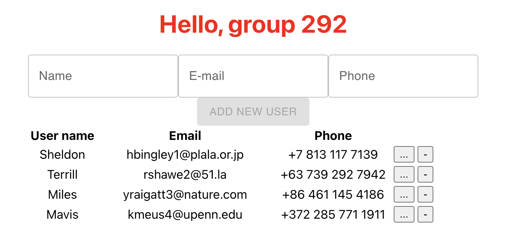

# Getting Started with Create React App

This project was bootstrapped with [Create React App](https://github.com/facebook/create-react-app).

## Available Scripts

In the project directory, you can run:

### `npm start`

Runs the app in the development mode.\
Open [http://localhost:3000](http://localhost:3000) to view it in your browser.

The page will reload when you make changes.\
You may also see any lint errors in the console.

---
You should get such ugly result on the start

Notice - now we have buttons for Add new user, delete existing and view details of the user.

Feel free to make any changes to optimize appearance and make it more usable and pretty.

Happy hacking, folks!